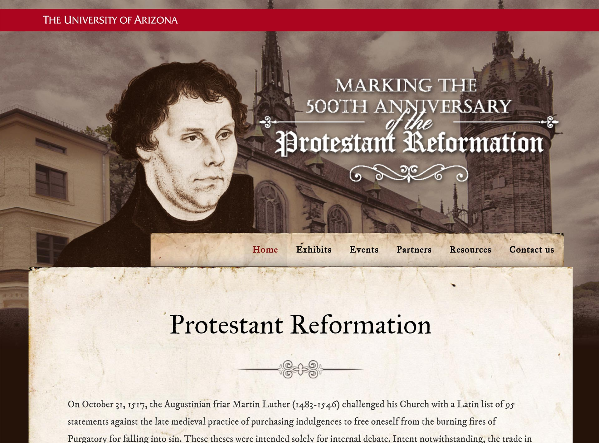

# UA Libraries Reformation Events Website - Static Archive

> This website is a static version of http://reformation.arizona.edu, preserved for archival purposes.



## Building

This static website was built by running this command:

```
wget --mirror --page-requisites --continue --convert-links --adjust-extension --directory-prefix=public http://reformation.arizona.edu
```

You can test locally by running `npm install` and `npm run serve`, which will fire off a development server at http://localhost:8888.

The static website is located in `public/reformation.arizona.edu`.

## Deploying

You can deploy the project by running `npm run deploy`. You might need to specify an AWS profile like this: `npm run deploy -- --profile=profilename`.

View at http://ualibr-reformation-arizona-edu.s3-website-us-west-2.amazonaws.com

## License

See the `LICENSE` file.
