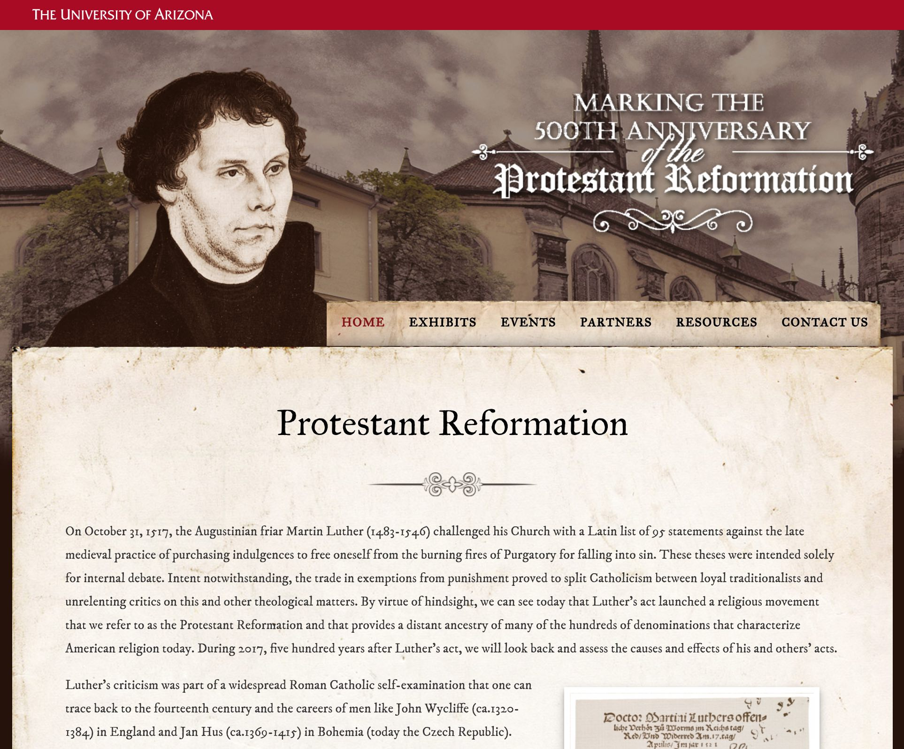

# UA Libraries Reformation Events Website - Static Archive

> This website is a static version of http://reformation.arizona.edu, preserved for archival purposes.



## Building

This static website was built by running `./build.sh`. The build script runs wget:

```sh
wget \
  --mirror \
  --page-requisites \
  --continue \
  --convert-links \
  --backup-converted \
  --adjust-extension \
  --directory-prefix=public \
  --no-host-directories \
  --user-agent="Mozilla/5.0" \
  --execute robots=off \
  --span-hosts \
  --domains reformation.arizona.edu,cdn.uadigital.arizona.edu,ajax.googleapis.com \
  http://reformation.arizona.edu
```

The static website is located in `public`.

## Testing

You can test locally by running `./serve.sh`. The script uses PHP to start a webserver at http://localhost:8888.

Verify that it isn't using any resources from reformation.arizona.edu by adding `127.0.0.1 reformation.arizona.edu` to your hosts file (`/etc/hosts`), and seeing if the site at http://localhost:8888 loads correctly.

```sh
php -S 127.0.0.1:8888 -t public/reformation.arizona.edu
```

## Deploying

You can deploy the project by running `./deploy.sh`. You might need to specify an AWS profile like this: `./deploy.sh --profile=<profile name>`.

`deploy.sh` uses [AWS CLI](https://aws.amazon.com/cli/) to deploy to an AWS S3 bucket.

```sh
aws s3 sync public/reformation.arizona.edu s3://ualibr-reformation-arizona-edu --delete
```

View at http://ualibr-reformation-arizona-edu.s3-website-us-west-2.amazonaws.com

## Further reading

* https://gist.github.com/dannguyen/03a10e850656577cfb57
* https://unix.stackexchange.com/questions/94488/ignore-other-domains-when-downloading-with-wget
* https://superuser.com/questions/129085/make-wget-download-page-resources-on-a-different-domain
* https://www.gnu.org/software/wget/manual/html_node/index.html#SEC_Contents

## License

```
Copyright (C) The Arizona Board of Regents on Behalf of the University of Arizona - All Rights Reserved
```
